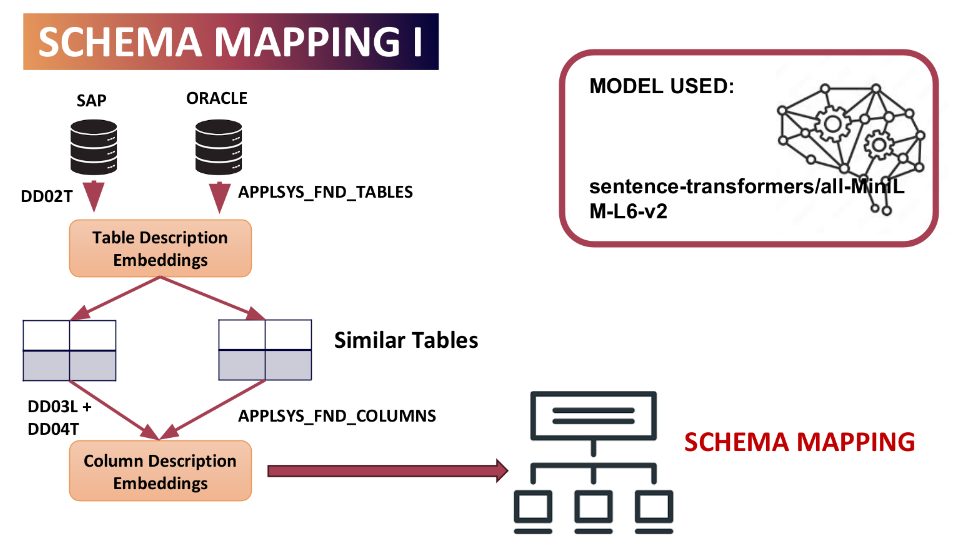
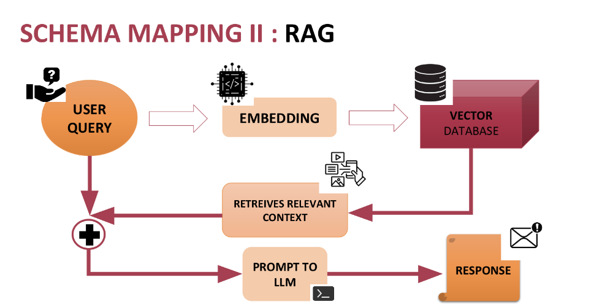
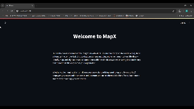

## Cross-Database Schema mapping
In the modern data-centric environment, organizations frequently utilize multiple database systems to store, manage, and analyze their data. These databases can vary significantly in terms of structure, terminology, and design principles. When integrating data from different sources, it becomes challenging for users, especially those unfamiliar with the specific systems, to identify similarities between tables and understand their structures. Manually exploring and mapping the schemas of numerous tables across different databases is a time-consuming and error-prone process.

## Implementation Architecture:
Our solutions develops a tool that can automate the process of schema mapping between different databases. Thus helping users identify tables and columns with similar structures and suggest potential mappings, making it easier to integrate and compare data from diverse sources.

We use 2 different approaches for automated Schema Mapping.
1. In the first approach we make use of [sentence transformer](https://huggingface.co/sentence-transformers) to generate embedding of the table description and the column description. Using the embeddings the similarity is computed and those values which is coming above the threshold value of 0.6 is considered a match.

  

    <b>Schema Mapping Approach 1</b> 

2.In the second approach we make use of Vector DB along with RAG for the automated schema mapping. The positive side about this approach is that the model provides a short explanation about its interpretation. 

  

    <b>Schema Mapping Approach 2</b> 

## Databases Used
1. ORACLE
2. SAP

## Application

  

    <b> MapX for Automated Schema Mapping</b>

